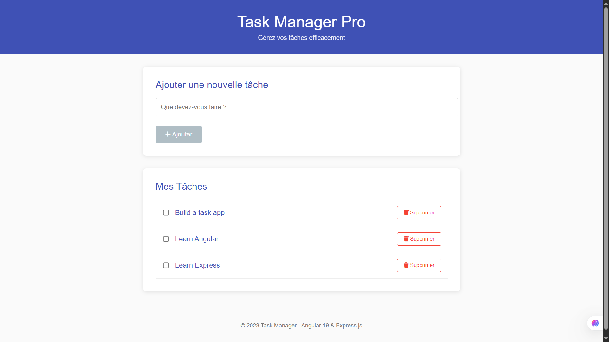

# 📝 Task Manager Application

Une application moderne de gestion de tâches développée avec :
- **Angular 19** (composants standalone) pour le frontend
- **Express.js** pour le backend
- Stockage des données en mémoire

## ✨ Fonctionnalités

- ✅ **CRUD complet** pour les tâches
- ☑️ **Marquer les tâches comme terminées**
- 📱 **Design responsive**
- 📝 **Validation des formulaires**
- ⚠️ **Gestion des erreurs**
- 🧩 **Architecture moderne** avec composants standalone

## 🛠 Technologies

### Frontend
- Angular 19
- TypeScript
- Reactive Forms
- Standalone Components
- RxJS

### Backend
- Express.js
- API RESTful
- Stockage en mémoire
- CORS

## 🚀 Installation

### Prérequis
- Node.js (v18+)
- npm (v9+)
- Angular CLI (v19)

### Backend
cd task-manager-backend
npm install
node server.js

### Frontend
cd task-manager-frontend
npm install
ng serve
Ouvrez ensuite http://localhost:4200 dans votre navigateur

##  🖼 Capture d'écran

